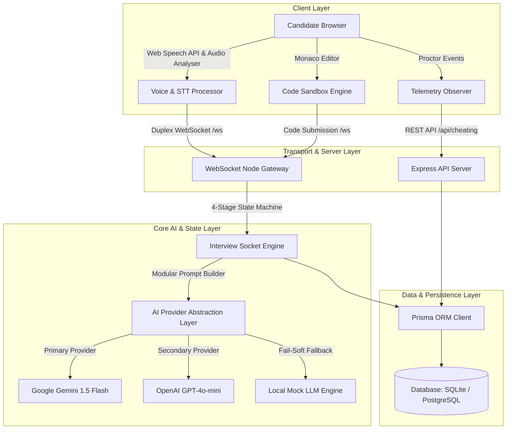

# 🤖 HireAI — Adaptive AI Technical Interview Platform

<div align="center">


**An enterprise-grade, real-time AI technical screening platform built with real-time voice streaming, proctoring telemetry, modular prompt state machines, and out-of-50 standardized scorecards.**

[🚀 Live Repository](https://github.com/amanjain-31/AI-Interview) · [🏗️ System Architecture](#-system-architecture--engineering-story) · [🧠 Engineering Mindset](#-engineering-mindset-how-i-solve-complex-systems-problems)

</div>

---

## 🧠 Engineering Mindset: How I Solve Complex Systems Problems

> *"As a Systems-Minded Software Engineer, my goal isn't just to write clean UI components—it's to architect resilient, fault-tolerant, and scalable software pipelines that operate deterministically under network instability and high load."* — **Aman Jain**

When engineering **HireAI**, I approached every core requirement by first identifying the underlying system challenges, designing decoupled solutions, and handling edge-case failures:

| System Challenge | Engineering Problem | System Design & Architectural Solution |
|---|---|---|
| **Real-Time Voice Streaming** | Network jitter & silent audio drops during candidate answers | Implemented Web Audio API `AnalyserNode` RMS decibel peak verification + continuous STT event loop + duplex WebSocket socket reconnection gateway. |
| **LLM Reliability & Downtime** | Third-party LLM rate limits (`429 Quota Exceeded`) mid-assessment | Designed a **Fail-Soft Provider Abstraction**: `Gemini 1.5 Flash` ➔ `OpenAI GPT-4o-mini` ➔ `Local Deterministic Mock Engine`. Zero assessment interruption. |
| **Prompt Engineering & Leaks** | Monolithic prompts hallucinating, leaking code solutions, or ignoring state | Architected a **4-Stage Finite State Machine** (`RESUME_Q` ➔ `SYSTEM_DESIGN` ➔ `BEHAVIORAL` ➔ `CODING`) with isolated prompt templates. |
| **Subjective Evaluation Bias** | Unstructured text evaluations giving inconsistent ratings | Standardized candidate scoring across **5 independent 10-point dimensions** (50 Pts total) mapped to deterministic hiring recommendations. |
| **Assessment Integrity** | Candidate cheating via tab switching, copy-pasting, or second screens | Implemented a client-side **Proctor Telemetry Observer** streaming infractions directly to `CheatingEvent` database tables. |

---

## 🎯 What is HireAI?

HireAI automates candidate technical screening through an adaptive, voice-enabled AI interviewer. It operates across two distinct, specialized portals:

- 🎓 **Student Arena (`/student`)**: A self-serve candidate practice flight deck featuring ATS resume parser diagnostics, target skill assessments, and unlimited mock interview runs.
- 👩‍💼 **Recruiter Hub (`/recruiter`)**: An enterprise candidate governance control center providing cohort proctoring telemetry logs, candidate score comparisons, and automated hiring recommendations.

---

## 🏗️ System Architecture & Engineering Story

### High-Level System Topology



---

## ⚖️ System Design Trade-Off Matrix

Every system design choice involves explicit trade-offs. Here is the engineering rationale behind HireAI's architectural decisions:

| Architectural Choice | Option Selected | Alternative Considered | Trade-Off Rationale |
|---|---|---|---|
| **Real-Time Transport** | **WebSockets (`ws`)** | HTTP Polling / Server-Sent Events | WebSockets provide sub-50ms full-duplex bi-directional streaming necessary for real-time speech dialogue. |
| **Speech-To-Text (STT)** | **Web Speech API + Audio Analyser** | Server-side Whisper API | In-browser Web Speech API reduces server network overhead to zero while AnalyserNode validates volume decibel peaks locally. |
| **State Orchestration** | **Finite State Machine** | Single Monolithic Prompt | A 4-phase state machine enforces explicit stage transitions, eliminating prompt drift and preventing solution leaks. |
| **Database ORM** | **Prisma ORM** | Raw SQL Queries | Prisma provides type-safe schema migrations, transactional guarantees, and seamless portability between SQLite (dev) and PostgreSQL (prod). |

---

## 🔬 Core Engineering Problems & Technical Solutions

### 1. How Real-Time Voice Sessions Are Handled
Voice input requires synchronous audio volume verification and continuous speech recognition to prevent awkward silent delays or mic dropouts.

- **Dual-Stream Web Audio Processing**: The browser initializes a Web Audio API `AnalyserNode` alongside `webkitSpeechRecognition`. While speech recognition transcribes continuous candidate speech, the `AnalyserNode` calculates real-time RMS decibel peaks.
- **Dynamic Decibel Thresholding**: Audio energy below `0.02 RMS` is filtered as background ambient noise, preventing background chatter from triggering spurious AI evaluations.
- **Audio/Text Fallback Toggle**: If microphone permissions are revoked or hardware disconnects mid-assessment, the platform dynamically exposes a manual text fallback input without severing the active WebSocket stream.

### 2. How AI Prompts Are Modularized
Rather than sending long, monolithic prompt strings that hallucinate or leak problem solutions, HireAI uses a 4-phase state machine engine:

- **Stage 1: `RESUME_Q`**: Asks candidate self-introductions and dynamically constructs technical questions around skills parsed from the candidate's uploaded PDF resume.
- **Stage 2: `SYSTEM_DESIGN`**: Evaluates architectural trade-offs, database indexing, caching strategies, and horizontal scaling.
- **Stage 3: `BEHAVIORAL`**: Conducts STAR-format situational interviews (Situation, Task, Action, Result).
- **Stage 4: `CODING`**: Issues algorithmic challenges (e.g., *Median of Two Sorted Arrays*) with starter code cleared to enforce authentic problem solving.

### 3. How Scoring is Standardized
To eliminate subjective interviewer bias, every candidate answer is evaluated against **5 independent scoring dimensions (0–10 points each)**, totaling a **50-point objective scorecard**:

| Dimension | Weight | Description |
|---|---|---|
| **Technical Accuracy** | 10 Pts | Correctness of algorithms, APIs, and computer science fundamentals |
| **Knowledge Depth** | 10 Pts | Nuance, memory complexity awareness, and edge-case handling |
| **Problem Solving** | 10 Pts | Structured step-by-step analytical reasoning |
| **Communication Clarity** | 10 Pts | Articulation, voice volume, and explanation structure |
| **Confidence & Fluency** | 10 Pts | Speech speed, lack of hesitation markers, and certainty |

#### Objective Recommendation Mapping
- **40 – 50 Pts**: `STRONG_YES` (Immediate Offer / Fast-track)
- **30 – 39 Pts**: `YES` (Proceed to Onsite Interview)
- **18 – 29 Pts**: `MAYBE` (Recruiter Debrief Required)
- **00 – 17 Pts**: `NO` (Screening Rejection)

### 4. How Fallback / Mock Mode Works
Third-party LLM API downtime or rate-limiting (`429 Too Many Requests`) must never interrupt a candidate mid-assessment.

- **Fail-Soft Abstraction**: `ai.service.ts` wraps LLM API calls in a graceful fall-through try-catch block:
  `Gemini 1.5 Flash` ➔ `OpenAI GPT-4o-mini` ➔ `Local Deterministic Mock Provider`.
- **Zero Interruption Guarantee**: If all cloud API keys fail or exhaust quota, the local Mock Provider evaluates answers using heuristic keyword density and code syntax analysis, ensuring the candidate completes their assessment smoothly.

---

## 🧪 Interactive Demo Explanation & Engineering Rationale

The main landing page includes an interactive **Speech & Communication Check Demo**.

### Why This Demo Exists
Before candidates enter a timed 45-minute technical assessment, technical screening platforms must validate browser audio readiness:
1. **Microphone Hardware Verification**: Confirms microphone access and permissions upfront.
2. **Volume Peak Calibration**: Tests ambient room noise floor to ensure candidate speech levels are legible.
3. **Speech Recognition Accuracy Check**: Proves that candidate voice inputs transcribe accurately before entering live scoring rounds.

---

## ⚡ Production Readiness & Enterprise Scalability

| Capability | Implementation Strategy |
|---|---|
| **Rate Limiting** | Sliding-window token bucket algorithm protecting REST endpoints and WebSocket handshake requests. |
| **Proctor Audit Logs** | Telemetry observer logging tab switches, window blur events, copy-paste triggers, and screen deviation infractions directly to `CheatingEvent` database tables. |
| **Session Persistence** | Full connection state recovery via `sessionId` parameters allowing candidates to reconnect gracefully after accidental browser refreshes. |
| **AI Provider Abstraction** | Decoupled `AIService` interface enabling instant swapping between Gemini, OpenAI, Claude, or custom fine-tuned models without altering websocket socket logic. |
| **Database Migration Strategy** | Managed via Prisma ORM. Zero-downtime migration path from local SQLite development instances to multi-region PostgreSQL clusters (`npx prisma migrate deploy`). |

---

## 🚀 Getting Started

### Prerequisites
- **Node.js** v18+
- **npm** v9+
- A free **Gemini API Key** or **OpenAI API Key** (Optional — fallback mock mode runs automatically without keys).

### 1. Clone & Install

```bash
git clone https://github.com/amanjain-31/AI-Interview.git
cd AI-Interview
npm install
```

### 2. Configure Environment Variables

Create `backend/.env`:
```env
GEMINI_API_KEY=your_gemini_api_key_here
GEMINI_MODEL=gemini-1.5-flash
```

### 3. Database Migration

```bash
cd backend
npx prisma migrate dev --name init
npx prisma generate
```

### 4. Run Development Servers

```bash
# Run both frontend (port 3000) & backend (port 8000) concurrently
npm run dev
```

Open **[http://localhost:3000](http://localhost:3000)** in your browser.

---

## 📄 License

MIT License — see [LICENSE](LICENSE) for details.

---

<div align="center">

Built with ❤️ by **Aman Jain** · Systems-Minded Software Engineer · [GitHub](https://github.com/amanjain-31)

</div>
